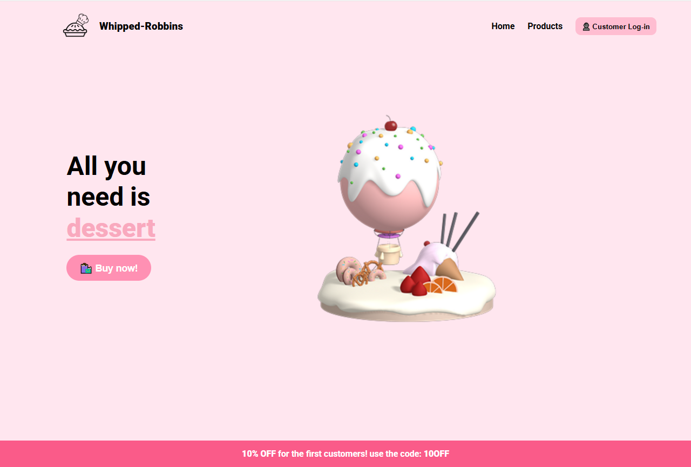

# 🍰 Whipped Robbins - Landing Page

A vibrant and responsive landing page for **Whipped Robbins**, a dessert brand that makes your cravings irresistible. Built with HTML and CSS only, this page is designed to be mobile-friendly, eye-catching, and effective for promotion.

---

## 🔥 Features

- 💻 **Responsive Layout** – Works great on desktops, tablets, and phones.
- 🎨 **Stylish Design** – Soft pink color palette with bold, dessert-themed typography.
- 🍓 **Fixed Promotion Banner** – Stays at the bottom of the screen for maximum visibility.
- 🍰 **Call-to-Action Button** – Encourages users to buy with a standout CTA.
- 👤 **Login Button** – Styled button for customer access.

---

## 🧱 Built With

- HTML5
- CSS3 (no frameworks)
- Google Fonts (Roboto)

---

## 📸 Preview

  

---

## 🚀 Getting Started

To run this project locally:

```bash
git clone https://github.com/gregdotdev/whipped-robbins-landing.git
cd whipped-robbins-landing
open index.html
